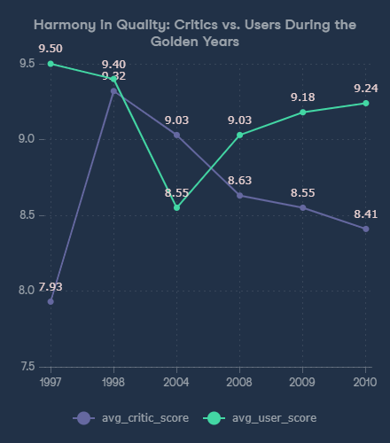
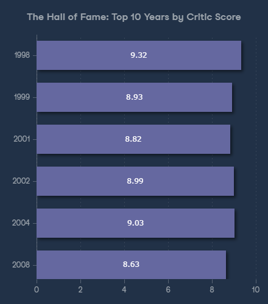
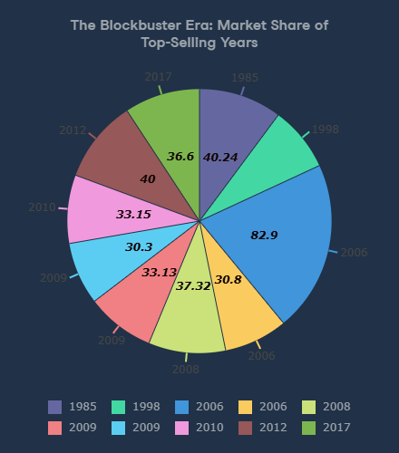

# 🎮 When Was the Golden Era of Video Games?

  

> **"Are video games getting better, or has the golden age already passed?"**

## 📖 Project Overview
According to Mordor Intelligence, the global gaming market is projected to exceed **$300 billion by 2027**. With such high stakes, understanding what defines a "hit" is crucial.

This project analyzes data for the **top 400 video games** released since 1977 to identify the industry's "Golden Era." By synthesizing data from **critic reviews**, **user sentiment**, and **global sales figures**, I explored the relationship between commercial success and artistic quality.

---

## 📊 Key Analysis & Insights

### 1. The Search for "Harmony": When Critics and Users Agreed
**The Challenge:** Critics and players often disagree. I wanted to find the specific years where *both* parties agreed that the games were legendary (scores > 9.0).

*Figure 1: Line chart comparing average critic vs. user scores during peak years.*

* **Insight:** The analysis identified **1998** as a pinnacle year where both critics (9.32) and users (9.40) were in near-perfect agreement.
* **Observation:** Post-2008, we observe a divergence; while user enthusiasm remained high (e.g., 2010), critic scores became more conservative, highlighting a shift in how games are evaluated professionally versus casually.

---

### 2. The "Hall of Fame": Best Years by Critical Acclaim
**The Challenge:** Identifying the historic peaks of game development quality, ensuring a fair sample size (years with at least 4 blockbuster hits).

*Figure 2: Top 10 years ranked by average critic score.*

* **Insight:** The late 90s and early 2000s dominate the quality charts.
* **Result:** **1998** stands out as the undisputed "Golden Year" in terms of quality, likely driven by revolutionary titles that defined genres for decades to come.

---

### 3. The "Blockbuster" Era: Sales Volume Analysis
**The Challenge:** Quality doesn't always equal sales. This query isolated the top 10 best-selling games to understand which years captured the biggest market share.

*Figure 3: Distribution of the top 10 best-selling games by release year.*

* **Insight:** While 1998 was the year of "Quality," **2006** (Wii era) was the year of "Mass Adoption."
* **Business Note:** Nintendo dominates this list (Wii Sports, Mario), proving that accessibility often drives higher sales volume than hardcore critical acclaim.

---

## 📂 Deliverables
* **📄 [Full Project Report (PDF)](the_Golden_Era_of_VideoGames.pdf):** A detailed walkthrough of the findings and methodology.
* **📸 Visualizations:** Generated charts representing the data analysis.
* **💻 SQL Scripts:** The raw `.sql` files are available in this repository for technical review.

---

### 📬 Contact
If you'd like to discuss the gaming industry trends or SQL analytics, feel free to reach out via my **[Portfolio Website](YOUR_PORTFOLIO_URL_HERE)**.
